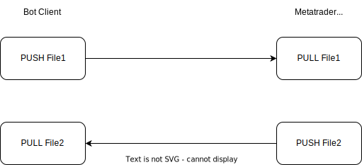

# Metatrader-Bridge-ZeroMQ
This repository contains a python client and a MQL4/5 server connector using ZeroMQ library

The code implements the two side "PUSH-PULL" pattern, based on the following diagram:

  

The python client sends a message throw a PUSH port binded to a receiver PULL port on the mql server side. 
When the server (the metatrader client terminal), which is listening in another port, process the 
message, PUSHes the answer through another port binded in this case to the receiver PULL port in the python client.

## Methods implemented.

1. Open Order. Opens an order for an instrument
2. Close Order. Closes an order based on the ticket id
3. Opened Orders. Get the opened orders info.
4. Equity. Get the trading account equity
5. Prices. Get the close bar prices based on the position (0 is the current bar).
6. Bid/Ask. Get the current market prices.

## Installation.

To install the mql binding follow the steps in the repository https://github.com/dingmaotu/mql-zmq.
To use the code you need to compile and attach the mql file to a metatrader chart. To open/close
an order or get info about an instrument, the symbol must be opened in the market watch.

## Acknowledgment

This code uses the Li Ding binding https://github.com/dingmaotu/mql-zmq of the ZeroMQ library for MQL4/5
language.
